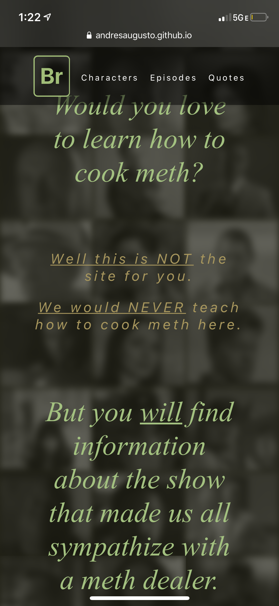
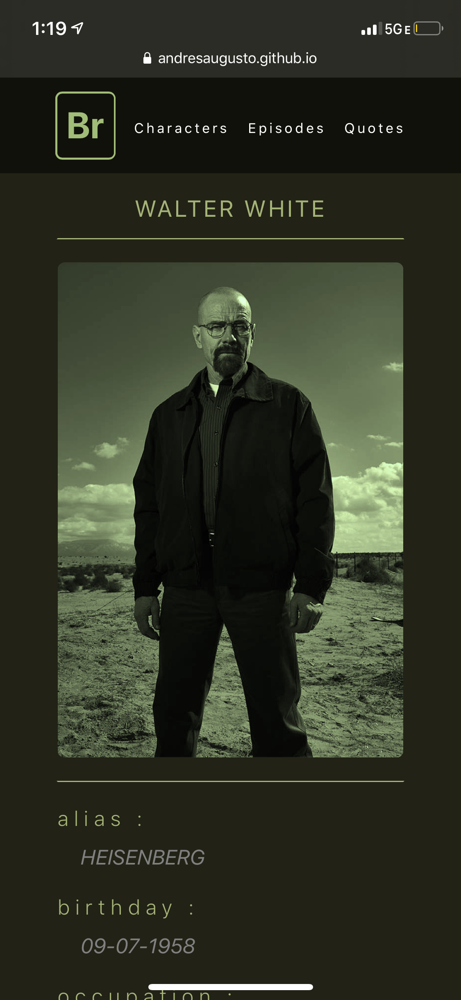
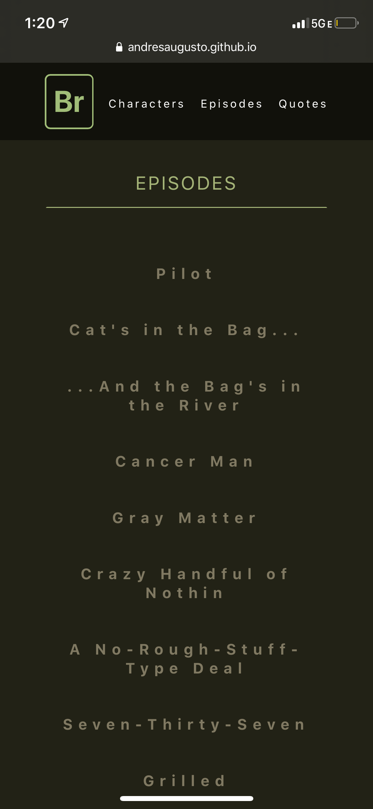
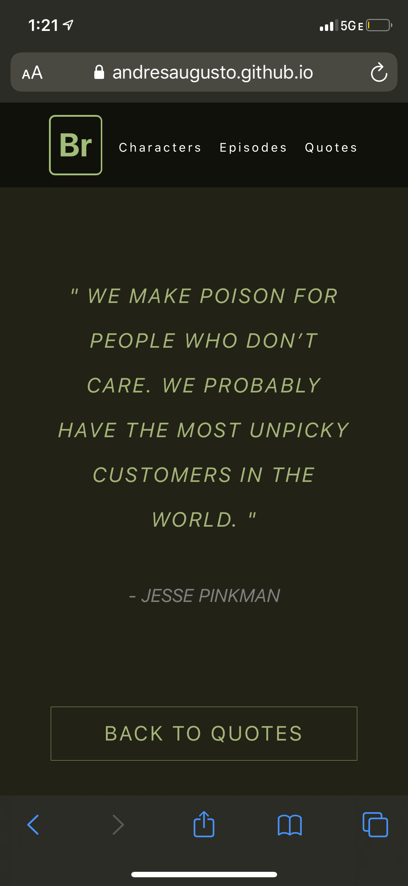

# Br

Powered by Tim Biles' "The Breaking Bad API", this application is a portal to information about the show's characters, episodes, and note-worthy quotes.

## Getting Started

This software requires no installation. It is fully accessible in the published webpage for everyone's access. It is created from a mobile-first perspective so feel free to explore it from your mobile device.

https://andresaugusto.github.io/Br/

## Built With

* [Visual Studio Code](https://code.visualstudio.com/)

## Languages/Technologies

* CSS3
* React JS
  * Hooks
  * React Router Navigation

## Passes

* [Validator.nu](https://html5.validator.nu/) - HTML5 Validator

## Authors

* **Andrés Augusto Ortiz Montalvo** - *Full-Stack Design and App Logic*
* **Tim Biles** - *Creation of API database "The Breaking Bad API", which powers the platform*

## Acknowledgments

* [Dev Ed](https://www.youtube.com/channel/UClb90NQQcskPUGDIXsQEz5Q) - for the quickest way to understand API calls with React JSX Hooks.
* Patricia Padilla - for your design feedback and moral support.
